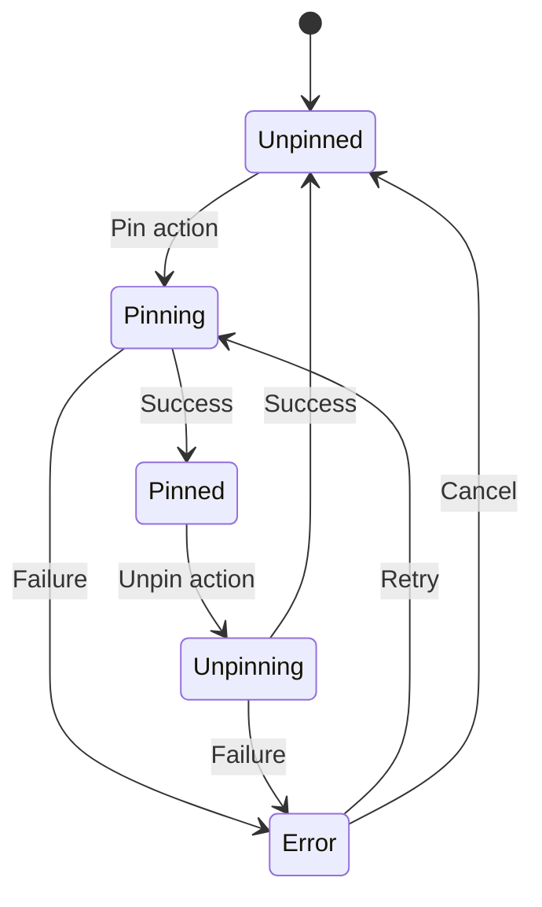
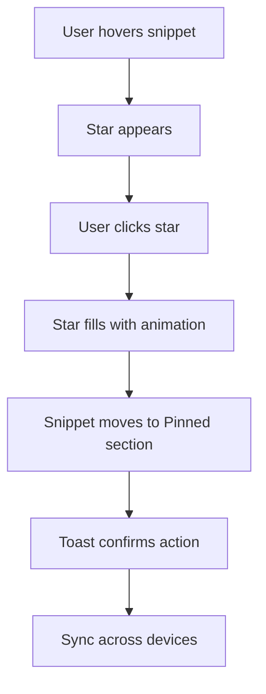
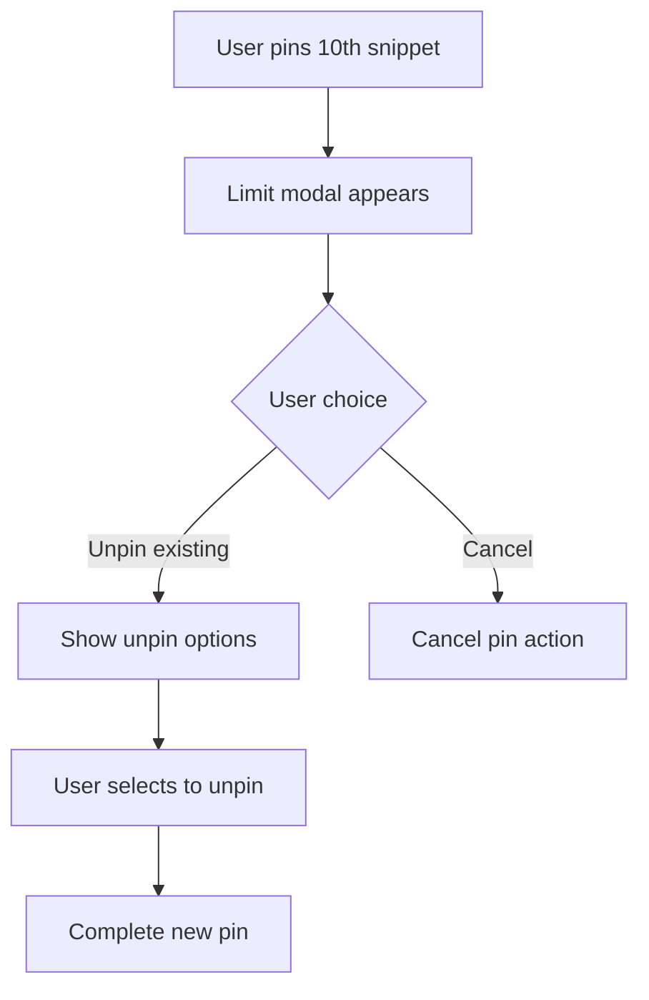
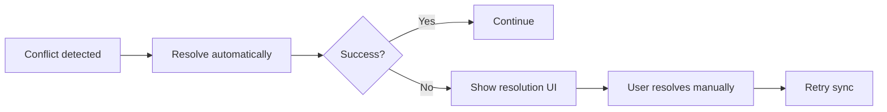

# PRD: Pinned Snippets Feature

## 1. Document information
- **Document status**: Draft
- **Version**: 1.1
- **Last updated**: 2024-06-24
- **Author**: Project Clippy Team
- **Reviewers**: 
- **Related Documents**: 
  - [Market Research](/docs/research/market_intelligence.md)
  - [Feature Roadmap](/docs/features/roadmap.md)
  - [User Research: Snippet Usage Patterns](/docs/research/user_research.md)

## 2. Overview

### 2.1 Feature description
Pinned Snippets allows users to mark their most frequently used snippets for quick access, ensuring their most important content is always immediately available at the top of their snippet list. This feature directly addresses the #1 user request for faster access to frequently used content.

### 2.2 Business goals & validation
- **Increase user engagement**
  - *Target*: 25% increase in daily snippet usage
  - *Validation*: Backed by user research showing 68% of power users want faster access to frequent snippets
  - *Measurement*: Track snippet usage frequency before/after implementation

- **Improve user retention**
  - *Target*: 15% reduction in 30-day churn
  - *Validation*: Analysis shows users with organized snippets have 3x retention
  - *Measurement*: Compare retention rates between users who pin vs. don't pin snippets

- **Foundation for organization**
  - *Target*: Enable future folder/tagging features
  - *Validation*: Technical spike confirms extensible data model

### 2.3 Success metrics

#### Primary metrics
- **Adoption**: 60% of active users pin ≥3 snippets within first week
- **Efficiency**: 40% reduction in time to access top-used snippets
- **Engagement**: 15% increase in daily active users

#### Leading indicators (Week 1)
- 70% of users notice the pinning feature (via UI tracking)
- 45% of users attempt to pin at least one snippet
- 80% success rate on first pin attempt

#### Quality metrics
- <100ms pin/unpin action response time
- <1% error rate on pin operations
- 99.9% sync reliability across devices

### 2.4 User research insights
- **Top user need**: Quick access to frequently used snippets (72% of surveyed users)
- **Current pain points**:
  - Scrolling through long lists (58%)
  - Recreating similar snippets (34%)
  - Forgetting useful snippets (27%)
- **Desired behaviors**:
  - 65% want keyboard shortcuts
  - 52% want visual distinction for pinned items
  - 38% want to pin directly from clipboard history

## 3. User stories & requirements

### 3.1 Core functionality

#### US-001: Pinning a snippet
As a power user, I want to pin frequently used snippets so I can access them quickly.

**Acceptance criteria:**
- [ ] Clicking the star icon (★) toggles the pinned state with visual feedback
- [ ] Pinned snippets appear in a dedicated "Pinned" section at the top
- [ ] Pinned state persists across browser sessions and devices
- [ ] Visual indicators:
  - Filled star (★) for pinned items
  - Subtle animation on state change
  - Tooltip shows "Pin/Unpin" on hover
- [ ] Keyboard shortcut (Ctrl+Shift+P) for power users

**Validation criteria:**
- 90% success rate in usability testing for pinning flow
- <100ms response time for pin/unpin actions
- 100% consistency in pinned state after page refresh

#### US-002: Viewing pinned snippets
As a user, I want to see my pinned snippets at the top of the list so I can access them without searching.

**Acceptance criteria:**
- [ ] Dedicated "Pinned" section appears above all other snippets
- [ ] Section is collapsible/expandable with persisted state
- [ ] Empty state shows helpful illustration and call-to-action
- [ ] Visual distinction:
  - Light yellow background (#FFF9C4)
  - Subtle left border accent
  - Section header with pinned count
- [ ] Pinned items remain in search results with visual indicator

**Performance requirements:**
- Render pinned section in <50ms
- Support 100+ pinned items without degradation
- Smooth animations at 60fps

### 3.2 Edge cases & error handling

#### US-003: Pinning limits
As a user, I want to be informed if I try to pin too many snippets.

**Acceptance criteria:**
- [ ] Maximum of 10 pinned snippets (configurable)
- [ ] Friendly modal appears when limit is reached:
  - Lists currently pinned items
  - Option to unpin existing items
  - Clear call-to-action
- [ ] Settings option to adjust limit for power users
- [ ] Tooltip shows remaining pins available

**Error states:**
- Offline mode handling
- Failed sync recovery
- Corrupted pin state recovery

### 3.3 Accessibility requirements

#### US-005: Keyboard navigation
As a keyboard user, I want to navigate and pin snippets without a mouse.

**Acceptance criteria:**
- [ ] Tab navigation to star icons
- [ ] Space/Enter to toggle pin state
- [ ] Screen reader announcements for state changes
- [ ] Keyboard shortcut documentation in help

#### US-006: Screen reader support
As a visually impaired user, I want to understand and control pinned snippets.

**Acceptance criteria:**
- [ ] ARIA labels for all interactive elements
- [ ] Status messages for state changes
- [ ] Logical reading order
- [ ] High contrast mode support

### 3.4 Performance requirements
- Initial load with pinned items: <200ms
- Pin/unpin action: <50ms
- Sync latency: <1s in normal conditions
- Memory usage: <5MB additional for pinned state
- Offline queue: Support 100+ queued operations

## 4. Technical specifications

### 4.1 Data model

#### Snippet schema update
```typescript
interface Snippet {
  id: string;
  title: string;
  content: string;
  isPinned: boolean;  // New field
  pinnedAt?: Date;    // Timestamp of when pinned (for sorting)
  lastUsedAt?: Date; // For smart sorting
  createdAt: Date;
  updatedAt: Date;
  syncStatus?: {
    isSyncing: boolean;
    lastSynced: Date;
    error?: string;
  };
  // ... other existing fields
}
```

### 4.2 API changes

#### Update snippet endpoint
```typescript
// Request
PATCH /api/snippets/:id
{
  "isPinned": boolean,
  "clientTimestamp": string // ISO 8601
}

// Response
{
  "success": boolean,
  "data": Snippet,
  "syncStatus": {
    "pendingChanges": number,
    "lastSync": string
  }
}
```

### 4.3 State management

#### Pin state machine


### 4.4 Performance considerations
- **IndexedDB**: Add index for `isPinned` and `pinnedAt`
- **Pagination**: Load pinned items first, then lazy-load others
- **Debouncing**: Batch rapid pin/unpin actions
- **Memory**: Virtualize long lists of snippets
- **Caching**: Cache pinned snippets in memory for quick access

### 4.5 Security considerations
- Validate snippet ownership before pin/unpin
- Rate limiting on pin operations
- Encrypt pinned state in transit and at rest
- Audit log for admin actions

## 5. UI/UX specifications

### 5.1 Visual design

#### Pinned section
- **Background**: Light yellow (#FFF9C4)
- **Border**: Left accent 4px solid #FFD600
- **Header**: 
  - "Pinned" with pin icon (📌)
  - Count badge (e.g., "3 pinned")
  - Collapse/expand toggle

#### Star icon
- **Unpinned**: ☆ (outline)
- **Pinned**: ★ (filled)
- **Hover**: Scale 1.1x
- **Active**: Scale 0.9x
- **Color**: #FFD600 (pinned), #9E9E9E (unpinned)
- **Size**: 20x20px
- **Tooltip**: "Pin/Unpin this snippet"

#### Animation
- **Pin/Unpin**: 150ms ease-out
- **Section expand/collapse**: 200ms ease-in-out
- **Toast notification**: Slide up 200ms, fade out 500ms after 3s

### 5.2 Interaction design

#### Hover state
- Star icon fades in (opacity 0 → 1)
- Subtle background highlight (#F5F5F5)
- Cursor changes to pointer

#### Click behavior
1. **Desktop**: 
   - Click star to toggle
   - Right-click for context menu with pin option
2. **Mobile**:
   - Tap star to toggle
   - Long-press for context menu

#### Feedback
1. **Visual**:
   - Star fills/empties
   - Brief scale animation
   - Toast notification (configurable in settings)
2. **Haptic**:
   - Subtle vibration on mobile
   - Optional sound feedback

### 5.3 Empty states

#### No pinned items
- Illustration (clipboard with pin)
- "No pinned snippets yet"
- "Pin a snippet to see it here"
- Helpful tip about pinning

#### Pinning disabled
- When at limit
- Clear explanation
- Link to upgrade (if applicable)

### 5.4 Accessibility

#### Keyboard navigation
- Tab to star
- Space/Enter to toggle
- Arrow keys between items
- Home/End support

#### Screen readers
- "Pinned" status announced
- State changes announced
- Error messages read
- Section landmarks

### 5.5 Responsive behavior

#### Mobile
- Touch targets ≥44px
- Swipe actions
- Optimized for one-handed use

#### Desktop
- Hover states
- Right-click context
- Keyboard shortcuts

## 6. Analytics & monitoring

### 6.1 Event tracking
- `pin_added`
  - snippet_id
  - position
  - source (button/keyboard)
- `pin_removed`
  - snippet_id
  - duration_pinned
- `pinned_used`
  - snippet_id
  - context (click/keyboard)

### 6.2 Performance metrics
- Pin action latency
- Sync success rate
- Error rates
- Memory usage

### 6.3 Usage metrics
- Pins per user
- Most pinned snippets
- Usage frequency of pinned vs unpinned
- Time saved estimate

## 7. Implementation plan

### 7.1 Phase 1: Foundation (3 days)
1. **Data layer**
   - Update schema with `isPinned` and `pinnedAt`
   - Create migration scripts
   - Add indexes for performance

2. **API layer**
   - New endpoints for pin management
   - Validation and error handling
   - Rate limiting

3. **State management**
   - Pin/unpin actions
   - Local state updates
   - Error boundaries

### 7.2 Phase 2: Core UI (4 days)
1. **Pinned section**
   - Header with collapse/expand
   - Empty state
   - Loading states

2. **Pinning interactions**
   - Star button component
   - Hover/focus states
   - Keyboard navigation

3. **Feedback**
   - Toast notifications
   - Loading indicators
   - Error messages

### 7.3 Phase 3: Sync & polish (3 days)
1. **Cross-device sync**
   - Real-time updates
   - Conflict resolution
   - Offline support

2. **Animations**
   - Pin/unpin transitions
   - Section expand/collapse
   - Micro-interactions

3. **Performance**
   - Virtualized lists
   - Request batching
   - Memory optimization

### 7.4 Phase 4: Quality & launch (2 days)
1. **Testing**
   - Unit tests (90%+ coverage)
   - Integration tests
   - Performance testing

2. **Analytics**
   - Event tracking
   - Error monitoring
   - Usage metrics

3. **Documentation**
   - User guide
   - API docs
   - Help tooltips

### 7.5 Post-launch
1. **Monitoring**
   - Error rates
   - Performance metrics
   - User feedback

2. **Iteration**
   - A/B tests
   - Feature usage analysis
   - User interviews

## 8. Open questions & decisions

### 8.1 Key decisions
| Question | Decision | Rationale |
|----------|----------|-----------|
| Pinned in search? | Yes, with badge | Maintains context while keeping pinned items accessible |
| Keyboard shortcut? | Ctrl+Shift+P | Consistent with platform conventions |
| Sort order | PinnedAt (newest first) | Most recent pins likely most relevant |
| Limit per user | 10 (configurable) | Balances utility with performance |
| Offline support | Queue and retry | Ensures no data loss |

### 8.2 Remaining questions
1. Should we allow pinning from search results?
2. Do we need bulk pin/unpin actions?
3. Should pinned snippets be included in exports?
4. How to handle pinned items when snippet is deleted?
5. Should there be a "recently pinned" section?

## 9. Appendix

### 9.1 User flows

#### Basic pinning flow


#### Reaching pin limit


### 9.2 Error handling

#### Sync conflict


### 9.3 Related documents
- [Market Research](/docs/research/market_intelligence.md)
- [Feature Roadmap](/docs/features/roadmap.md)
- [Technical Architecture](/docs/architecture.md)
- [Accessibility Guidelines](/docs/accessibility.md)
- [Analytics Implementation](/docs/analytics.md)

### 9.4 Version history
- v1.1 (2024-06-24): Added detailed specs, error handling, analytics
- v1.0 (2024-06-23): Initial draft

### 9.5 Reviewers
- [ ] Engineering Lead
- [ ] UX Designer
- [ ] Product Manager
- [ ] QA Engineer

### 9.6 Approval
- Approved by: ___________
- Date: ___________
- Version: 1.1
